# Progressive Notebooks

The best environment to use **ProgressiVis** is the [Jupyter lab notebook](https://jupyterlab.readthedocs.io/en/latest/) with extensions supported in the package called `ipyprogressivis`.
This package provides **ProgressiVis** specific support for the user interface and visualizations, as well as components to explore CSV and Apache Arrow datasets.

(create-scenario)=

## Creating a progressive analysis

Notebooks hosting a progressive scenario need to be initialized in a particular way. We call them **ProgressiBooks** and they must be created via the `Progressivis/New ProgressiBook` menu, made available with `ipyprogressivis`:


Once created, a `Run ProgressiVis` button will appear in the first `ProgressiBook` cell.

By clicking this button, `ProgressiVis` is launched and the starting box will appear. A new scenario always begins by defining a data source. Currently, it proposes three data loading options. Two of them are predefined (`CSV loader` and `PARQUET loader`) and the third is the possibility to define (i.e. to code in Python) a customized loader. The starting box also offers the option of saving the session for later use by checking the `record this scenario` box. These actions, like all other actions in the scenario, are implemented via a set of `chaining widgets`.


## Chaining widgets

As their name suggests, chaining widgets (`CW`) are graphical components based on Jupyter widgets that can be composed to implement progressive data analysis scenarios. Their interconnection capabilities enable the creation of directed acyclic graphs (DAGs).

Each `CW` is designed for a specific stage of an analysis scenario (data loading, filtering, joins, etc.) and is associated with a sub-graph of ProgressiVis modules in the background, usually grouped behind a front panel.

Chaining widgets encapsulate and connect a subgraph of ProgressiVis modules that would take several line of code to create for no benefit.

## Navigation with the DAG Widget

The DAG widget, shown in the top right of a progressive notebook, as shown above, represents all the cell as a dependency graph. It show a navigation structure complementary to the sequential list of cells in the notebook. It stays on the right side of your notebook and you can navigate to any cell by clicking on a node.


Progressive programs need to support non-linear navigation. In a traditional notebook, when you run a cell, it is completed and you can move to the next. With a progressive program, the initial cell can continue to live for a long time, and visualize new data over time. Therefore, when moving to a new step of an analysis, it is often useful to navigate back to a previous one to monitor the progression or fork a new progressive analysis. In the end, several cells will remain active until you decide which ones to stop because they already gave you the answer you wanted, or because you realized they would not give you what you expected.


The chaining widgets automatically give a meaningful name to each cell/node to populate the graph and
keep it readable.
In addition, the graph also shows you when a widget needs attention or is finished so you can keep an overview of the progression of the analysis.

All the sections of this documentation use the DAG Widget to provide a high-level overview of progressive pipelines. The detailed graph visualization used in the [user guide](userguide) could be used as well, but it would give too much details on the topology of the progressive dataflow for a high-level overview.

## A `ProgressiBook` user guide

Let's return to the scenario developed in the userguide, starting with the [basic variant](basic-variant).

By combining two _CWs_: `CSVLoader` and `Heatmap`, we'll reproduce the same behaviour (i.e. which doesn't deal with the bounds issue).


```{eval-rst}
.. note::
   The CSVLoader features advanced configuration mechanisms (column selection, retyping, filtering etc.) via the CSV sniffer, which is described with more details :ref:`here<sniffer>`
```

The notebook below is available and ready to run [in the ipyprogressivis repository](https://github.com/progressivis/ipyprogressivis/blob/main/notebooks/userguide-widgets1.0.ipynb):


```{eval-rst}
.. raw:: html

   <iframe src="_static/userguide-widgets1.0.html" height="700px" width="100%"></iframe>

```

To go further and take into account the (assumed known) bounds like [the second snippet in the user guide](filtering-variant), we can use the filtering capabilities available to the CSV sniffer this way:


then renew the operation for `pickup_latitude`, click **Start loading csv** button, chain with a `Heatmap` widget, configure it with the appropriate columns and you get the expected result:


But if you don't know the bounds a priori, you can eliminate the noise using quantiles like [this python code](quantiles-variant) do because a `Quantile` chaining widget is available. The notebook below show this approach. It is available and ready to be replayed [here](https://github.com/progressivis/ipyprogressivis/blob/main/notebooks/userguide-widgets1.1.ipynb)
:


```{eval-rst}
.. raw:: html

   <iframe src="_static/userguide-widgets1.1.html" height="700px" width="100%"></iframe>

```


Finaly if you want to control the bounds dynamically, you can simply implement the third approach in the guide ([see the Python code here](range-query-2d)) by assembling predefined widgets.

In concrete terms, instead of connecting Heatmap to the CSVLoader output, you need to insert a RangeQuery2D widget between the two widgets already mentioned, this way:


## Chaining widgets list

We give a summary of the chaining widgets available here.

### Data loaders category

There are three main loaders: the CSV loader, the PARQUET/Arrow loader, and custom loaders.
For CSV and Arrow files, we provide additional functionalities to investigate the structure of the files and specify what columns to load, the concrete types to use, and more details.

#### CSV loader

Usually, the first cell of a progressive analysis is a data loader, below the root, creating this
possible topology:


##### Function:

The CSV loader, as it name implies, loads one or many CSV files progressively.

After starting, the main interface looks like this:


Where:

* The `Bookmarks` field displays the contents (previously filled in by hand) of the `bookmarks` file in `$HOME/.progressivis`. Lines selected here represent urls ans local files to be loaded. You can select one or more lines in this field. You can also ignore it and use the following field:
* `New URLs`: if the urls or local files present in bookmarks are not suitable, you can enter new paths here
* `URL to sniff`: Unique  url or local file to be used by the sniffer to discover data. If empty, the sniffer uses the first line among those selected for loading
* `Rows`: number of rows to be taken into account  by the sniffer to discover data
* `Throttle:`force the loader to limit the number of lines loaded at each step
* `Sniff ...` button: displays the sniffer (image below):


(sniffer)=
##### The Sniffer

The **sniffer**, among other things, allows you to customize parsing options, select the desired subset of columns and type them.

Once the configuration is complete, you can save it for later use, so you don't have to refill all the options manually, and start loading.


Once loading has begun, the `Next stage` list and the `Chain it` button will be used to attach a new `CW` to the treatments.


#### PARQUET Loader

Possible topology:


##### Function:

It loads one PARQUET file progressively

After starting, the main interface is:


You have to activate the sniffer and select the desired columns before loading:


(custom-loader)=

#### CUSTOM Loader

Possible topology:

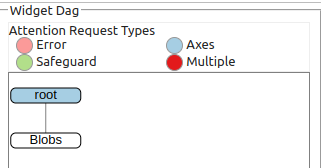

##### Function:

Allows users to code their own loader in _Python_.


This widget is an alias for the [Snippet widget](snippet-widget), which lets you integrate portions of user-supplied code into a `ProgressiBook` scenario.
The only difference from the general case is that the module corresponding to the `input_module` parameter does not supply data, and is
useful exclusively to get the scheduler. Consequently, the widget created will always be attached to the root of the `DAG`.

An example is provided [here](scenario-with_snippets). You can see that the following snippet (representing a progressive data generator) uses the `input_module` parameter only to obtain the scheduler:


```python
# progressivis-snippet
from progressivis.stats.blobs_table import BlobsPTable
from progressivis.core.api import Sink

# NB: register_snippet and SnippetResult used below
# were already imported from ipyprogressivis.widgets.chaining.custom

@register_snippet
def blobs_table(input_module, input_slot, columns):
    n_samples = 100_000_000
    n_components = 2
    rtol = 0.01
    centers = [(0.1, 0.3, 0.5), (0.7, 0.5, 3.3), (-0.4, -0.3, -11.1)]
    scheduler = input_module.scheduler()
    with scheduler:
        data = BlobsPTable(columns=['_0', '_1', '_2'],  centers=centers,
                           cluster_std=0.2, rows=n_samples, scheduler=scheduler)
        sink = Sink(scheduler=scheduler)
        sink.input.inp = data.output.result
    return SnippetResult(output_module=data, output_slot="result")
```

### Table operators category

#### Group By

Possible topology:

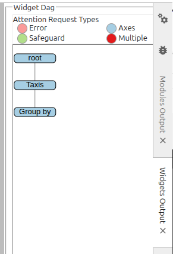

##### Function:

It groups the indexes of rows containing the same value for the selected column:


Given that tables can contain multi-dimensional values (in particular, the datetime type is represented as a vector with 6 elements: year, month, day, hour, minute, second), this `CW` introduces the notion of sub-columns, enabling rows to be grouped according to a subset of positions (6 sub-columns, in a datetime column). For example, indexes corresponding to the same day can be grouped together in a datetime column by selecting the first 3 sub-columns: year, month, day:


#### Aggregate

Possible topology:


##### Function:

Allows predefined operations to be performed on table rows previously grouped via a **Group by** `CW`:


Each input (column, operation) pair generates a dedicated column in the output table:


#### Join

Possible topology:


##### Function:

Performs a join between two table outputs via one or more columns. Sub-column joins (in the sense described above for group-by) are also supported.

ProgressiVis currently supports `one to one` and `one to many` joins (but not `many to many`).

In a `one to many` join, the table on the `one` side is called `primary` and the table on the `many` side is called `related`.

Obviously, in a `one to one` join, the two roles are interchangeable:

The first step is to select the two inputs and define their respective roles then click `OK`:


We can now define the join and select the columns to be kept in the join from among those in the primary table:


... and those in the related table:


The resultant join table is:


#### View: a computed columns creator

Possible topology:

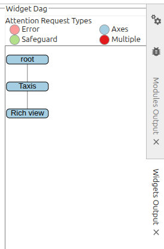


##### Function:

In addition to stored columns, `ProgressiVis` tables support virtual columns computed from the contents of other columns. Computed columns can be created [programmatically](#computed-columns) or, in some cases, via the **GUI** shown here.

At present, only [](SingleColFunc) columns can be defined through this interface.

This includes:

* numpy universal unary [functions](numpy.ufunc)
* `ProgressiVis` vectorized functions
* ad-hoc defined `if-else` expressions


As numpy functions are numerous, you can deactivate them if you don't need them to lighten the presentation. In this way, only vectorized functions will be displayed:


For example, if you want a new column representing the logarithm of another stored column, you can proceed as follows (note that other stored columns can be selected to appear as they are in the result view):

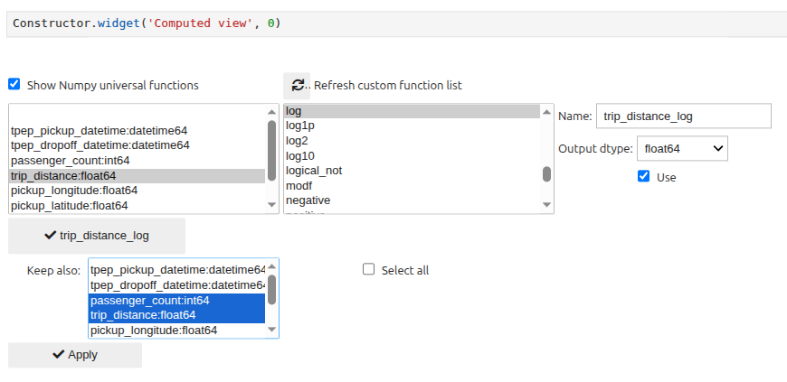

giving the following result:


An example involving a `ProgressiVis` vectorizable function is the creation of a column providing the (human friendly) week day from a stored `datetime` column:


which produce the following result:


An example using `if-else` expressions is taken from the weather domain. Some datasets providing rainfall information mix floating values with the symbol `T`, which means _trace amount of precipitation_, i.e. [a very small amount of rain that might wet the ground, but is too small to be detected in a rain gauge](https://geo.libretexts.org/Bookshelves/Meteorology_and_Climate_Science/Practical_Meteorology_(Stull)/07%3A_Precipitation_Processes/7.07%3A_Precipitation_Characteristics).

Assuming we want to replace “T” with a float value (say -1.0) to have only float values, we'll create an 'if-else' expression as follows:


then use it to create a computed column based on the `PrecipitationIn`stored column:


to produce the following result:


#### Façade creator

The [facade concept](#facade-concept) is particularly useful in the context of `chaining widgets`, as it enables the chaining of widgets managing complex networks of modules. Currently, chaining widgets support many input modules, but only one output module. In complex cases requiring many output modules, these will be grouped together behind a facade representing the single, module-alike, output.

Possible topology:


##### Function:

Visual tool for building a [](TableFacade) around a main module by adding descriptive and filtering modules of column-level granularity.

The `Settings` pane includes several tabs that group the columns of the input table according to their type family: numeric, string and categorical, with the exception of the first tab named `All columns`.


This first tab does two things:

* designate columns to be ignored
* designate columns to be treated as categorical, as this characteristic cannot be deduced from the physical type of the column, because it is linked to the semantics of the data.

The other tabs allow you to associate the desired descriptive statistics and filtering operations with each column. Grouping columns by type family is motivated by the need to associate appropriate operations with each family (for example, variance computing is only justified for numerical types).

Obviously, the widest range of operations is proposed for numerical types:


### Free coding category

(snippet-widget)=
#### Snippet

Possible topology:

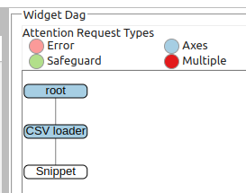


##### Function:

This is a widget that lets you insert custom code into a `CW` topology.

The user code must first be imported or defined in one or more cells. To be usable by the system, it must respect a few simple conventions:

* the first line of each cell must begin with the comment `# progressivis-snippet`

* The user code must be made accessible through a function that respects the following signature:
```python
def name_to_be changed(input_module: Module, input_slot: str, columns: list[str]) -> SnippetReturn | None:
    ... # the typing is optional but recommended
```
* this function must be decorated with the `@register_snippet` decorator already imported into the runtime context from `ipyprogressivis.widgets.chaining.custom`:

```python
@register_snippet
def my_fonction(input_module: Module, input_slot: str, columns: list[str]) -> SnippetResult | None:
    ...

# or

from my_module import my_function
register_snippet(my_function)
```

* the function must return a `SnippetResult` object (the underlying class is already imported into the runtime context from `ipyprogressivis.widgets.chaining.custom`) or None if it implements a "leaf" component.

The widget lets you choose how columns will be passed to the snippet function (all, a selection of columns as a list, a selection as a dictionary):

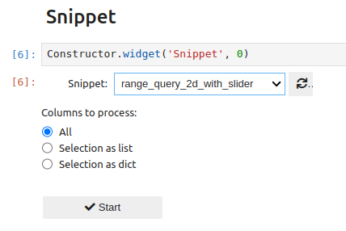

By selecting a list, a multiple selection is proposed:

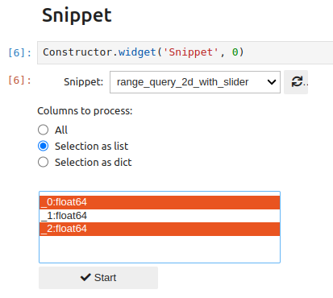

If a dictionary is chosen, keys must be entered for the selected columns:

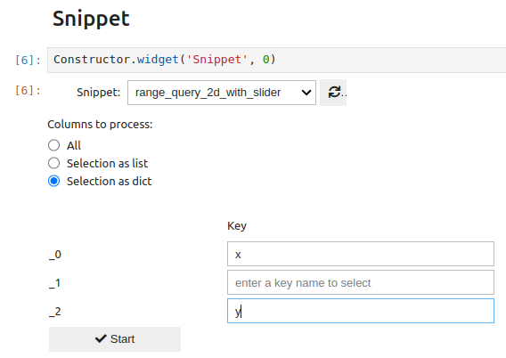


Two complete examples are provided [here](scenario-with_snippets). The first one is a loader (there are no input data) and the second implements an interactive range query 2D widget featuring several progressivis artifacts.

#### CUSTOM Loader

This is an alias of the [Snippet](snippet-widget), useful when code is not chained from another `CW`. This is the case for custom data loaders explained [here](custom-loader)


#### Other custom functions

Some widgets can use user-defined functions (e.g. `View`, `GroupBy` and `Aggregate`).

To be visible in the interface of the underlying widgets, these functions must respect a few conventions:

* like snippets, they must be defined or imported in cells beginning with the comment `# progressivis-snippet`
* they must be decorated with the `@register_function` decorator
* their signature must comply with the requirements of the addressed progressivis module.

A complete example is provided [here](taxis-precipitations-line-chart).

In the underlying function  definition:

```python
# progressivis-snippets
import numpy as np
@register_function
@np.vectorize
def rain_level(val: float) -> str:
    if np.isnan(val) or val < 0.07:
        return "No"
    if val < 0.19:
        return "Light"
    return "Rain"
```

We can see that the `rain_level` function is decorated with `@register_function` to be visible for widgets. On the other hand, it's vectorization (via @numpy.vectorize) is a requirement of the underlying [progressivis feature](computed-columns).


### Display tools category

#### Dump table

Possible topology:

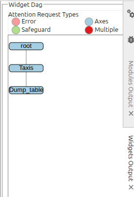


##### Function:

This is the simplest chaining widget that requires no configuration. It is used to display progressive table outputs and has already been used to illustrate the outputs of the widgets presented above.

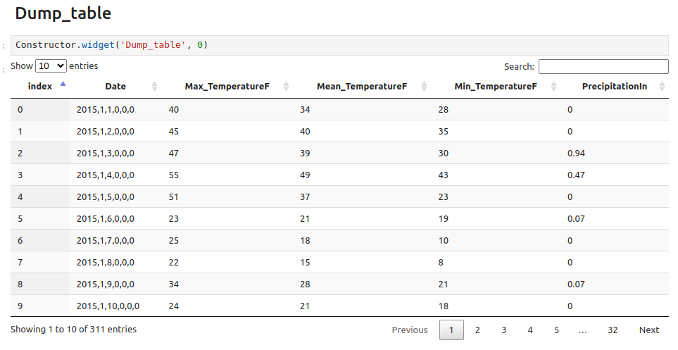


#### Descriptive statistics

Possible topology:


##### Function:

This chaining widget brings together several descriptive statistics processes.

The `Settings / General` editor is designed to define operations on a single variable, with the exception of covariance calculation, which involves several variables:


Simple results are displayed together:


while the covariance matrix is shown in a separate panel:


Histograms (1D) are also displayed in a dedicated panel. This display is divided into two parts:

* at the top, a rough histogram of the entire interval of variable values, completed by two vertical rulers (in red) that can be positioned using the `Range` slider to delimit a sub-interval.
* at the bottom, a more detailed histogram for the interval defined in the first part:


Heatmaps are used to visualize 2D histograms. Variable pairs are selected for visualization in a dedicated editor:


Each heatmap will be displayed in a dedicated panel:


#### Heatmap

Possible topology:


##### Function:

This widget provides the same functionality as the namesake tab in "Descriptive statistics" (i.e. visualize 2D histograms), but with greater freedom of configuration.

Given that currently:

* a histogram requires many entries (data, minimum, maximum)
* a source widget can expose only one connectable output module

the `Heatmap` widget must be connected to the output of a `Façade` widget, configured to produce thre required entries:

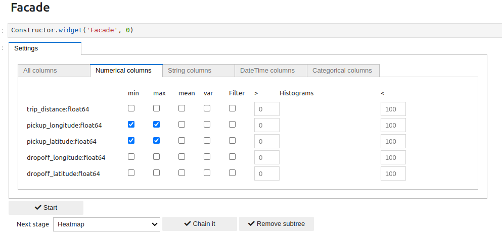

Once connected, the widget can be configured as follows


#### Multi-series


Possible topology:


##### Function:

This widget allows you to view several time series together:


#### Any Vega

Possible topology:


##### Function:


Allows a user to integrate vega-based visualizations from customized schemas into a scenario. Schemas can be edited, saved and reused in a similar way to `CSV loader` settings.

NB: The entry for an _Any Vega_ widget is always a `Facade`.


The "fetch info" button extracts the list of fields present in the schema before pairing them with members of the input facade and associating them (potentially) with element-wise processing operations.


The rendering is similar to previous ones:


(recording-scenario)=
## Recording a scenario

A `ProgressiBook` lets you save a scenario for later replay. The record is persistent and it is contained in the `ProgressiBook` itself, so it's a good idea to save it at the end of the recording (even if Jupyter does automatic backups periodically).

The scenario is saved only if the corresponding checkbox (named "Save this scenario") in the start widget is checked and it is done by default. The choice must be made before starting.


After that, the scenario is built as explained [above](create-scenario).


**NB:** Scenario registration should not be confused with the [persistent settings](#persistent-settings) of certain widgets, which are saved in dedicated files and can also be used in unregistered scenarios.
```{eval-rst}
.. note::
   Scenario registration should not be confused with the  :ref:`persistent settings<persistent-settings>` of certain widgets, which are saved in dedicated files and can also be used in unregistered scenarios.
```

(replay-scenario)=
## Replay a scenario

After opening a `ProgressiBook` containing a backup and clicking the `Run PeogressiVis` button, the dialog box below appears:

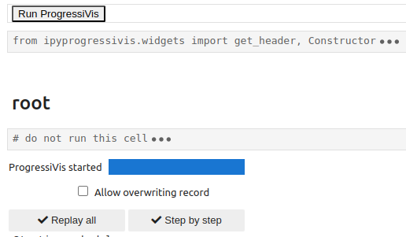

Once a scenario has been recorded, there are two wais to reuse it:

* read-only mode
* read/write mode

Both read-only and read/write modes support two alternatives:

* replay all
* step-by-step

In the `replay all` variant, all nodes in the backup are executed without any further interaction with the user (apart from those required by the scenario widgets themselves).

In the `step-by-step` variant, a dialog is initiated with the user and the nodes are activated one after the other when the operator presses the corresponding `Next` button.

### Replay in read-only mode

This is the default mode. To keep it, leave the `Allow overwriting record` box unchecked. In this mode, the scenario will be replayed identically, and the backup remains unchanged. When the scenario is replayed `step-by-step`
only the `Next` button is active since `Edit` and `Delete` buttons are gray.


When `replay all` is chosen, chaining bars are absent on nodes, so no modification of the graph is possible.

In this mode, widgets are replaced by snapshots taken at the moment of widget creation and they may not reflect the exact state of the configuration. `step-by-step` is mainly useful for observing and understanding graph generation in a decomposed way.

### Replay in read/write mode

This mode is active when the `Allow overwriting record` box is **checked**.

In this mode, the `replay all` variant takes place in much the same way as in the previous mode, but each node has a bar that allows you to enrich the scenario with new nodes, as you did in the creation stage.

The `step-by-step` variant lets you intervene on existing nodes to modify certain parameters:

* By clicking the `Edit` button, the configuration widget associated with this node will appear, allowing complete reconfiguration of the node. The user must ensure that the new configuration is consistent with further processing because the action is irreversible.
* By clicking on `Delete`, the node in question and all its descendants will be deleted. Once again, the user must be certain of the validity of the operation, as it is irreversible.
* If the current node is to remain unchanged, click `Next` to continue.

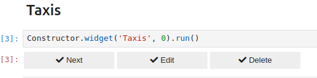

(persistent-settings)=
## Chaining widgets persistent settings

`CW`s keeps track of its states and history with a file tree located in the user's homedir with the following structure:

```
.progressivis/
├── bookmarks
└── widget_settings
    └── CsvLoaderW
        ├── taxis
        └── weather
    └── ParquetLoaderW
        ├── iris
        └── penguins
    ...
    ...
```

**NB:** Only the `.progressivis` directory needs to be created by the user. All other directories and files will be created by widgets as required.


## How to create a chaining widget ?

Comming soon ...
