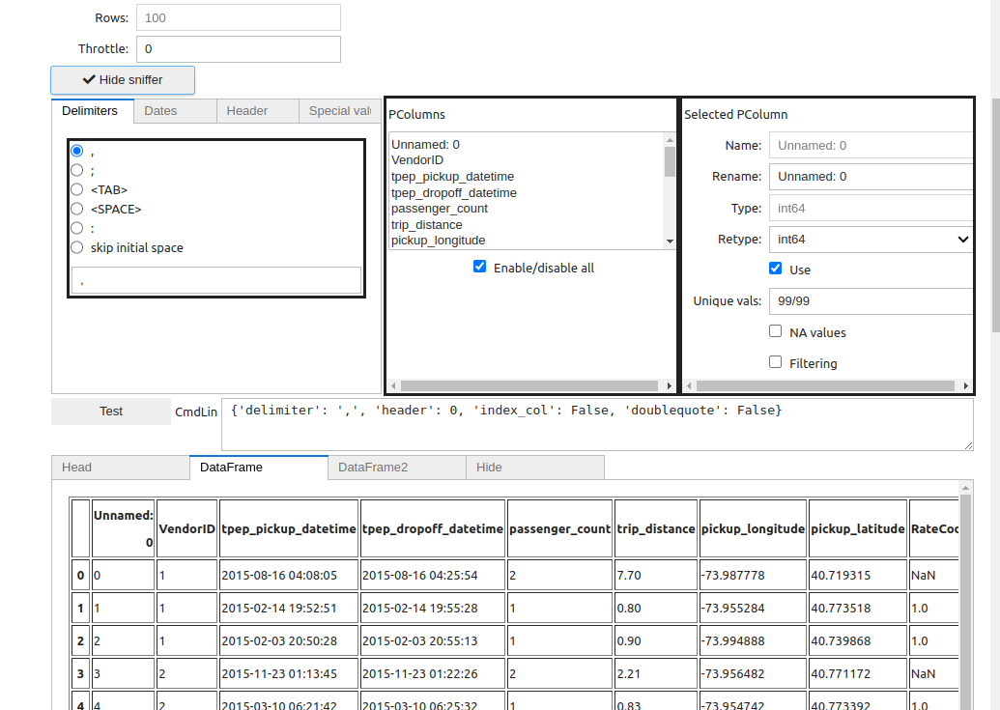

```{eval-rst}
:orphan:
```

# The Sniffer


The **sniffer**, among other things, allows you to customize parsing options, select the desired subset of columns and type them.

Once the configuration is complete, you can save it for later use, so you don't have to refill all the options manually, and start loading.

