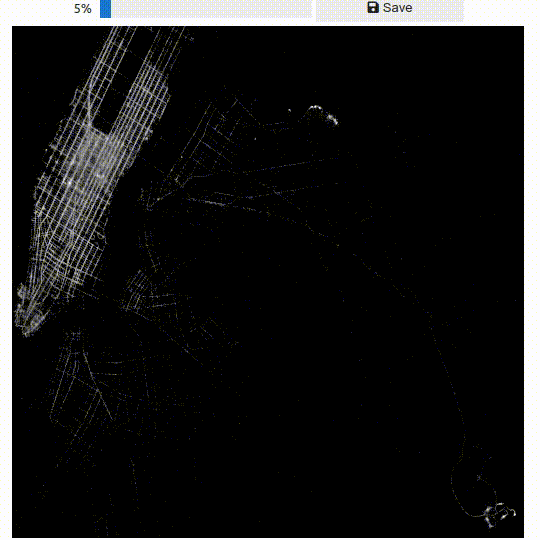
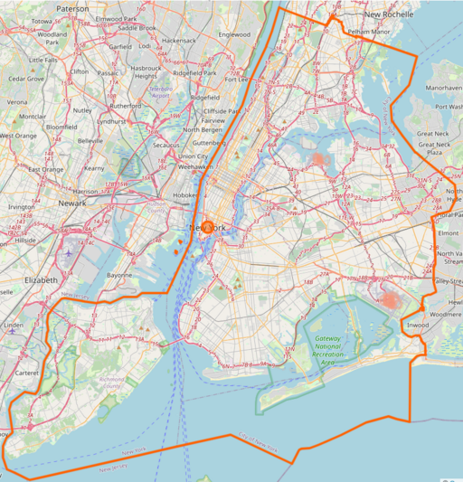
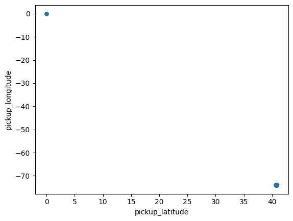
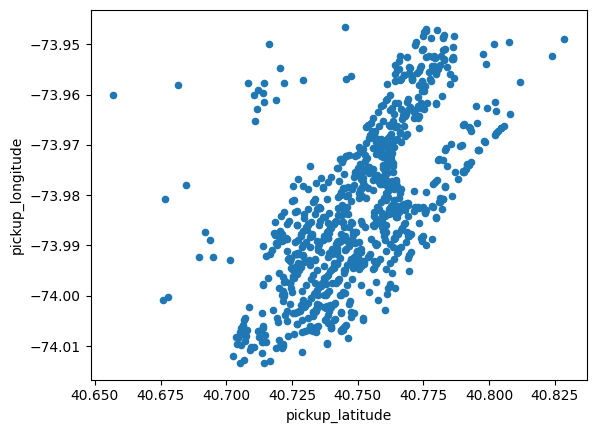

# User Guide


**ProgressiVis** is a language and system implementing **progressive data analysis and visualization**.
**ProgressiVis** is designed so that it never blocks while executing functions, even if their execution time lasts for an unbounded amount of time. For example, when loading a large file from the network until completion.

In a traditional computation system, you cannot do much about the time taken when calling a function. Waiting while loading a large file over the network is the price to pay for having it loaded and starting computations over its contents. In a non-progressive system meant to be used interactively, when a function takes too long to complete, the user waits, gets bored, and her attention drops.  **ProgressiVis** is designed to avoid this attention drop.

If you are familiar with asynchronous programming or real time programming, you will be familiar with the need to follow strict disciplines to make sure a system is not blocking.
This discipline is implemented everywhere in **progressiVis** with a specific "progressive" semantics.

## Key concepts

**ProgressiVis** uses specific constructs to remain reactive and interactive all the time.
Let's start with a simple progressive program to introduce the concepts.  Assume we want to find out what are the busy places in New York City.
We can download the New York Taxi dataset that contain all the taxi trips in 2015 and 2016, including the pickup and drop-off positions, looking for hot-spots.

For January 2015, the file `yellow_tripdata_2015-01.csv.bz2` is 327Mb long in compressed form and contains about 12M lines (12,748,987). Downloading the file and uncompressing it before the data is loaded in memory can take minutes. Meanwhile, the user is waiting idly with no information about the file content.

With **ProgressiVis**, we don't need to wait for the file to be fully loaded to visualize it, we can do it on the go, as with this simple low-level ProgressiVis program.

All the programs shown here are available in the `notebook` directory of **ProgressiVis** as `userguide1.ipynb`, `userguide1.2.ipynb` and `userguide1.3.ipynb` so you don't have to copy/paste them from this documentation.  To run the examples, connect to the `progressivis` directory you downloaded from `github.com` and launch the Jupyter lab notebook by typing, in a command line:
```sh
jupyter lab
```
Then, open the `notebooks` directory and load the notebook `userguide1.ipynb`. The code you see next should appear, with a few additional comments. You can run the notebook cells with the "play" icon on top.

(quantiles-variant)=

```{code-block}
:linenos:
from progressivis import CSVLoader, Histogram2D, Quantiles, Heatmap

LARGE_TAXI_FILE = ("https://www.aviz.fr/nyc-taxi/"
                   "yellow_tripdata_2015-01.csv.bz2")
RESOLUTION=512

csv = CSVLoader(LARGE_TAXI_FILE, index_col=False,
                usecols=['pickup_longitude', 'pickup_latitude'])

quantiles = Quantiles()
quantiles.input.table = csv.output.result

histogram2d = Histogram2D('pickup_longitude', 'pickup_latitude',
                          xbins=RESOLUTION, ybins=RESOLUTION)
histogram2d.input.table = quantiles.output.table
histogram2d.input.min = quantiles.output.result[0.03]
histogram2d.input.max = quantiles.output.result[0.97]

heatmap = Heatmap()
heatmap.input.array = histogram2d.output.result

heatmap.display_notebook()
csv.scheduler().task_start()
```

The image of all the taxi pickup positions appears immediately. All taxi pickup positions are overlaid at each pixel to produce a density map that becomes more detailed progressively, revealing the shape of Manhattan and the two New York City airports, La Guardia in the center top and JFK at the bottom right.  Yellow taxis in NYC are only authorized to pick up clients in Manhattan and in the airports, or when returning from their drop-off location; this is visible in the visualized patterns.

 

With a standard visualization system, or using Pandas from python, you would have to wait several minutes to see the visualization due to the load time of the file.
**ProgressiVis** shows the results in a few seconds, improving over time, irrespective to the file size and network speed.

Let's explain the program. Line 7 creates a `CSV` loader module, providing the url of the taxi datasets and limiting the table to two columns: `pickup_longitude` and `pickup_latitude` that will be used in the example.
When created, the module does not start right away but after line 23 in that case when the whole program is started.

Then, on line 10, a `Quantiles` module is created and connected to the `CSV` loader in line 11.  Modules can have input and output slots to connect them and let data flow between them. The slots are usually typed so the `CSV` output slot produces a data table and the `Quantiles` module expects a data table in its input.

The `Quantiles` module will maintain an internal data structure to quickly (but approximately) compute quantiles over all the loaded numerical columns (it is called a data sketch). This is because the minimum and maximum of the dataset are noisy.
ProgressiVis is designed for scalability and managing big data. Big data is never clean; the taxi dataset is no exception. Using the absolute minimum and maximum values of the data column would produce weird results. Instead, we are using the 3% and 97% quantiles, maintained progressively, to avoid outliers.

On line 13, a `Histogram2D` module is created to count all the pick up locations on a grid of 512x512. It is connected to the table produced by the `CSV` module on line 15, and to the 3% and 97% quantiles computed by the Quantiles module in lines 16-17 for its minimum and maximum values. Note that, when connecting slots, ProgressiVis allows specifying arguments, providing details about the connection; they are called "slot hints". For the output slot "result" of the `Quantiles` module on line 16-17, the argument is simply the desired quantile between 0 and 1.

Finaly, a `Heatmap` module is created in line 19 and connected to the output of the `Histogram2D` module. It will convert the 2D histogram into an image ready to be displayed in the notebook, line 22.

The progressive program is started in line 23 and the image will appear almost immediately, improving over time. The bounds may move a bit when more points are loaded. In that case, the image will be redisplayed progressively with the new bounds at the same page, about one image every 2-3 seconds.

At this stage, ProgressiVis is used in a streaming mode, loading the data and visualizing the results as it goes. We will introduce interaction later, after introducing the concepts first.

Variations of this program are discussed in [a followup section](#dealing-with-noisy-data), if you are interested in more details about loading a large CSV file.

## Main Components

In **ProgressiVis**, a program is run by a `Scheduler`. Only one instance of `Scheduler` exists (except in tests), and in our example, it is passed implicitly everywhere.
A progressive program is internally represented as a dataflow of progressive modules (simply called **modules** in this documentation).
The dataflow is a directed network with no cycle (a directed acyclic graph or DAG).

A `Module` represents the equivalent of a function in a traditional python program.
It is made of input and output slots; one output slot of a module can be connected to several input slots of other modules.
Some input slots are **optional**, and others are **mandatory** for a module to run.
Furthermore, a slot is **typed** since it carries data between modules.
A module with no input slot is a **source module**, and a module with no output slot is a **sink module**.
```{eval-rst}
.. _hint-reference-label:
```
When specifying a connection, input slots can be supplemented by `hints`, provided in square brackets . The role and type of hints depends on the semantics of the slot. In the next example the sequence of names provided in square brackets designates the columns to be taken into account (and processed) by the module:

```python
from progressivis import RandomTable, Max, Print

random = RandomPTable(10, rows=10000)
# produces 10 columns named _1, _2, ...
max_ = Max()
max_.input[0] = random.output.result["_1", "_2", "_3"]
# slot hints to restrict the columns to ("_1", "_2", "_3")
pr = Print(proc=self.terse)
pr.input[0] = max_.output.result
random.scheduler().task_start()
```
Here, the hint tells the `Max` module to compute the maximum only for columns "_1", "_2", "_3".
Otherwise, when no hint is provided, the maximum is computed for all the columns.

In addition to input and output slots, a module maintains a set of **parameters** that it uses internally.
Finally, some modules are **interactive** and can receive **events**, typically from the user interface or visualization interactions to **control** (stop, resume, step the execution) or **steer** the computation.

Most progressive programs are composed of existing modules, created with specific parameters and connected to form a specific program.
However, new modules can be programmed to implement a new function, to add an algorithm, a loader for a new file format, or a new visualization.
Programming a module is explained in the advanced section of this documentation.

## Running a Progressive Program

The easiest environment to run progressive programs is jupyter lab notebooks.
**ProgressiVis** comes with widgets, visualizations, and mechanisms to navigate a notebooks in a non-linear way to follow the progression of modules.
ProgressiVis offers two levels of programming, a low-level, as shown in the first example above, and a high-level designed for jupyter lab notebooks, more convenient, hiding boilerplate code and providing convenient widgets and navigation mechanisms to manage the non-sequential style of ProgressiVis programs.

Alternatively, progressive programs can be run in a _headless_ environment.


## Communication between ProgressiVis and the Notebook

ProgressiVis is built on top of python asynchronous functions. The communication between ProgressiVis and the notebook is done through callbacks and function calls.
Module callbacks are handy to update the environment outside of ProgressiVis.
    For example, visualizing the heatmap shown in the first example works like this (see also the Jupyter Notebook widgets documentation at [ipywidgets.readthedocs.io](https://ipywidgets.readthedocs.io/)):
```python
import ipywidgets as ipw
from IPython.display import display

# Create an empty Image widget and display it in the notebook
img = ipw.Image(value=b'\x00', width=width, height=height)
display(img)

# Define a callback (not that it is `async`)
# that runs after the heatmap module is updated
async def _after_run(m: Module, run_number: int) -> None:
    assert isinstance(m, Heatmap)
    image = m.get_image_bin()  # get the image from the heatmap
    if image is not None:
        img.value = image
        # Replace the displayed image with the new one

heatmap.on_after_run(_after_run)  # Install the callback
```

On the other direction, an external function can trigger changes in a ProgressiVis program in a few ways. There is a low-level mechanisms based on the method `Module.from_input(msg)` that allows communicating with modules. The module `Variable` is the simplest module designed to handle external events through `from_input`. Its implementation of `from_input` expects a dictionary that is then propagated as data in its output slot in the progressive program. Most of the interactions proposed in ProgressiVis are done through `Variable` modules. Reusing the same declarations as in the examples above, we can add dynamic filtering to the data being progressively loaded with the following code:

(range-query-2d)=
```{code-block}
:linenos:
from progressivis import (CSVLoader, Histogram2D, Heatmap, PDict,
                          BinningIndexND, RangeQuery2D, Variable)

col_x = "pickup_longitude"
col_y = "pickup_latitude"

csv = CSVLoader(LARGE_TAXI_FILE, index_col=False, usecols=[col_x, col_y])
index = BinningIndexND()
index.input.table = csv.output.result[col_x, col_y]
query = RangeQuery2D(column_x=col_x, column_y=col_y)
var_min = Variable(name="var_min")
var_max = Variable(name="var_max")
query.input.lower = var_min.output.result
query.input.upper = var_max.output.result
query.input.index = index.output.result
query.input.min = index.output.min_out
query.input.max = index.output.max_out

histogram2d = Histogram2D(col_x, col_y, xbins=RESOLUTION, ybins=RESOLUTION)
histogram2d.input.table = query.output.result
histogram2d.input.min = query.output.min
histogram2d.input.max = query.output.max

heatmap = Heatmap()
heatmap.input.array = histogram2d.output.result
heatmap.display_notebook()
csv.scheduler().task_start();
```

Visualizing the dataflow graph shows a cleaner view of the structure of the program.

```{eval-rst}
.. progressivis_dot:: ./userguide1.3.py
```

Compared to the initial non interactive program, we have added lines 12-26.  Line 13 creates a `BinningIndexND` that progessively maintains an index to all the numerical columns, allowing to quickly perform range queries over a large dataset. It is connected to the `CSV` module on line 15, with a slot hint restricting it to maintaining the index on two columns.

Line 17 creates a `RangeQuery2D` module that creates a table filtered by a 2D range query. The outputs of this module are connected to the `Histogram2D` module on lines 30-32 instead of the min/max quantiles and the table produced by the `CSV` table in the first example. The `RangeQuery2D` module ouputs the current min/max ranges and the table filtered according to these ranges to the `Histogram2D` module that gets visualized like in the first example. The `RangeQuery2D` module takes two variables `var_min` and `var_max`, declared line 19-20m to specify the desired min-max range that the user wants to see. The variables can be controlled by a jupyter notebook range-query widget to pass the information from the notebook to the progressive program, as shown in the next listing.

```{eval-rst}
.. literalinclude:: ./userguide1.3-cont.py
   :linenos:
```

Line 11 and 12 use the `Module.from_input` method to initialize the
 value of `var_min` and `var_max` to `bnds_min` and `bnds_max` respectively.
 Then, two range sliders are created line 14 and line 26 to filter a range of values
 between the specified bounds of the visualization.
 The `observer()` function is attached as callback of these two sliders to collect the
 slider values and send them to `var_min` and `var_max` on line 42-43.
 Setting them in the callback will force the histogram to recompute with the new bounds and, in turn, trigger an update of the heatmap every time the sliders are moved.

Building a progressive visualization and making it interactive is conceptually easy with ProgressiVis, but can need long boilerplate code. To simplify the construction of complex loading, analysis, and visualization progressive pipelines, we provide higher-level abstractions in jupyter lab notebooks.  They are documented in the [notebooks section](notebooks).

# Dealing with Noisy Data

Big data is almost always noisy. The techniques that work on small data
should be adapted to overcome this noise. As an illustration, the
simplest program we can think of to visualize the New York Taxi
dataset is the follwing:

```python
from progressivis import CSVLoader, Histogram2D, Min, Max, Heatmap

LARGE_TAXI_FILE = ("https://www.aviz.fr/nyc-taxi/"
                   "yellow_tripdata_2015-01.csv.bz2")
RESOLUTION=512

csv = CSVLoader(LARGE_TAXI_FILE, index_col=False,
                usecols=['pickup_longitude', 'pickup_latitude'])

min = Min()
min.input.table = csv.output.result

max = Max()
max.input.table = csv.output.result

histogram2d = Histogram2D('pickup_longitude', 'pickup_latitude',
                          xbins=RESOLUTION, ybins=RESOLUTION)
histogram2d.input.table = csv.output.result
histogram2d.input.min = min.output.result
histogram2d.input.max = max.output.result

heatmap = Heatmap()
heatmap.input.array = histogram2d.output.result
```

Instead of using the `Quantiles` module presented in the first example, it simply uses `Min` and `Max` to obtain the bounds of the pickup positions before computing the heatmap image.
It works as well, but the resulting image is unexpected:



This is due to taxis driving to Florida (bottom right, sometimes invisible on high-resolution displays) or other far away places and forgetting to stop their meters.
The `Quantiles` module allows getting rid of outliers that always exist in real data, that is always noisy.

Alternatively, you may know the boundaries of NYC and specify them:
(filtering-variant)=
```python
from progressivis import (CSVLoader, Histogram2D, ConstDict,
                          Heatmap, PDict)
from dataclasses import dataclass

LARGE_TAXI_FILE = ("https://www.aviz.fr/nyc-taxi/"
                   "yellow_tripdata_2015-01.csv.bz2")
RESOLUTION=512

@dataclass
class Bounds:
    top: float = 40.92
    bottom: float = 40.49
    left: float = -74.27
    right: float = -73.68

bounds = Bounds()
col_x = "pickup_longitude"
col_y = "pickup_latitude"

csv = CSVLoader(LARGE_TAXI_FILE, index_col=False,
                usecols=[col_x, col_y])

min = ConstDict(PDict({col_x: bounds.left, col_y: bounds.bottom}))
max = ConstDict(PDict({col_x: bounds.right, col_y: bounds.top}))

histogram2d = Histogram2D(col_x, col_y,
                          xbins=RESOLUTION, ybins=RESOLUTION)
histogram2d.input.table = csv.output.result
histogram2d.input.min = min.output.result
histogram2d.input.max = max.output.result

heatmap = Heatmap()
heatmap.input.array = histogram2d.output.result
...
```

The result is then perfect, but you need to provide extra information, i.e., the boundaries of the image.


