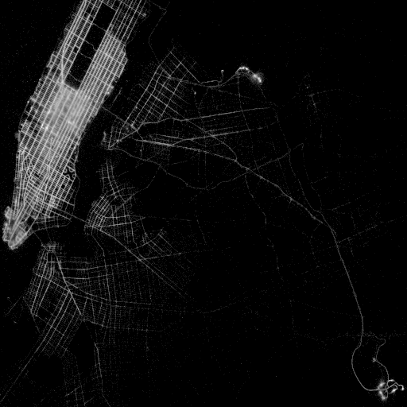

# User Guide


**ProgressiVis** is a language and system implementing **progressive data analysis and visualization**.
If you are familiar with asynchronous programming or real time programming, you will be familiar with the need to follow strict disciplines to make sure a system is not blocked. `ProgressiVis` is also designed so that it never runs functions that take an unbounded amount of time, such as loading a large file from the network until completion.
In a traditional computation system, you don't worry much about the time taken when calling a function; loading a large file over the network is the price to pay for having it loaded and starting computations over its contents. In a progressive system, meant to be used interactively, when a function takes too long to complete, the user waits, get bored, and her attention drops.  `ProgressiVis` is designed to avoid this attention drop.

## Key concepts

**ProgressiVis** uses specific constructs to remain reactive and interactive all the time.
Let's start with a simple non progressive program to introduce the concept.  Assume we want to find out what are the popular places to go in New York City.

With `ProgressiVis`, you can load the data and don't need to wait for the file to be fully loaded to visualize it, you can do it on the go, as with this bare-bone low-level ProgressiVis program:

```python
from progressivis.io import CSVLoader
from progressivis.stats import Histogram2D, Min, Max
from progressivis.vis import Heatmap

LARGE_TAXI_FILE = "https://www.aviz.fr/nyc-taxi/yellow_tripdata_2015-01.csv.bz2"
bounds = {"top": 40.92, "bottom": 40.49, "left": -74.27, "right": -73.68}

# Function to filter out trips outside of NYC.
# Since there are outliers in the files.
def filter_(df):
    lon = df['pickup_longitude']
    lat = df['pickup_latitude']
    return df[(lon>bounds["left"])&(lon<bounds["right"])&(lat>bounds["bottom"])&(lat<bounds["top"])]

# Create a csv loader filtering out data outside NYC
csv = CSVLoader(LARGE_TAXI_FILE, index_col=False, filter_=filter_)

min = Min() # Create a module to compute the min value progressively
min.input.table = csv.output.result # Connect it to the csv module

max = Max()  # Create a module to compute the max value progressively
max.input.table = csv.output.result  # Connect it to the csv module

# Create a module to compute the 2D histogram of the two columns specified
# with the given resolution
histogram2d = Histogram2D('pickup_longitude', 'pickup_latitude', xbins=512, ybins=512)
histogram2d.input.table = csv.output.result  # Connect the module to the table
histogram2d.input.min = min.output.result    # the min value
histogram2d.input.max = max.output.result    # and the max value

# Create a module to create an heatmap image from the histogram2d
heatmap = Heatmap()
heatmap.input.array = histogram2d.output.result  # Connect it to the histogram2d

heatmap.display_notebook()  # visualize the heatmap

csv.scheduler().task_start()  # Start the scheduler, run the program
```

The image of all the taxi pickup positions appears immediately  and get more detailed progressively, revealing the shape of Manhattan and the two New York City airports.


With a standard visualization system, or using Pandas from python, the visualization would take minutes to show due to the time needed to load the file.

## Main Components

In `ProgressiVis`, a program is run by a `Scheduler`. Only one instance of `Scheduler` exists (except tests). A progressive program is internally represented as a dataflow of progressive modules (simply called **modules** in this documentation). The dataflow is a directed network with no cycle (a directed acyclic graph or DAG).

A `Module` represents the equivalent of a function in a progressive
program.  It is made of input and output slots; one output slot of a
module can be connected to several input slots of other modules. Some
input slots are **optional**, and others are **mandatory**. Furthermore, a slot
is **typed** since it carries data between the modules.  A module with no input slot is a **source module**, and a module with no output slot is a **sink module**.
```{eval-rst}
.. _hint-reference-label:
```
Input slots can be supplemented by `hints`, provided in square brackets at the time of allocation. The role and type of hints depends on the semantics of the slot. In the next example the sequence of names provided in square brackets designates the columns to be taken into account (and processed) by the module:

```python
s = Scheduler()
random = RandomPTable(10, rows=10000, scheduler=s)
max_ = Max(name="max_" + str(hash(random)), scheduler=s)
max_.input[0] = random.output.result["_1", "_2", "_3"]  # hint ("_1", "_2", "_3")
pr = Print(proc=self.terse, scheduler=s)
pr.input[0] = max_.output.result
...
```
Here, the hint "tells" to the `Max` module to compute the maximum only for columns "_1", "_2", "_3". Otherwise, when no hint is provided, the maximum is computed for all columns.

In addition to input and output slots, a module maintains a set of **parameters** that it uses internally. Finally, some modules are **interactive** and can receive **events**, typically from the user interface or visualization interactions to **control** (stop, resume, step the execution) or **steer** the computation.

Most progressive program is composed of existing modules, created with specific parameters and connected to form a specific program. However, new modules can be programmed to implement a new function to add an algorithm, a loader for a new file format, or a new visualization. Programming a module is explained in the advanced section of this documentation.

## Running a Progressive Program

The easiest environment to run progressive programs is the JupyterLab notebook. `ProgressiVis` comes with specified widgets, visualizations, and mechanisms to navigate a notebook in a non-linear way to follow the progression of modules.

Alternatively, progressive programs can be run in a _headless_ environment. We also provide an experimental setup to run them behind a web server to create progressive applications without a notebook. This setup is experimental and should be extended in the future.


