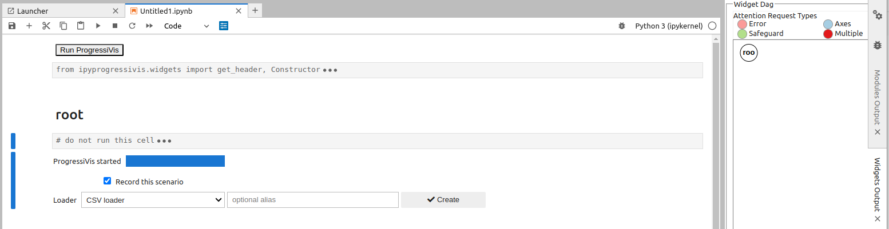
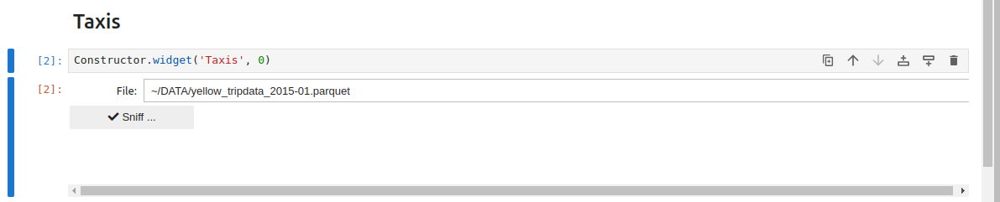
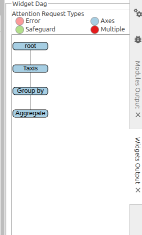
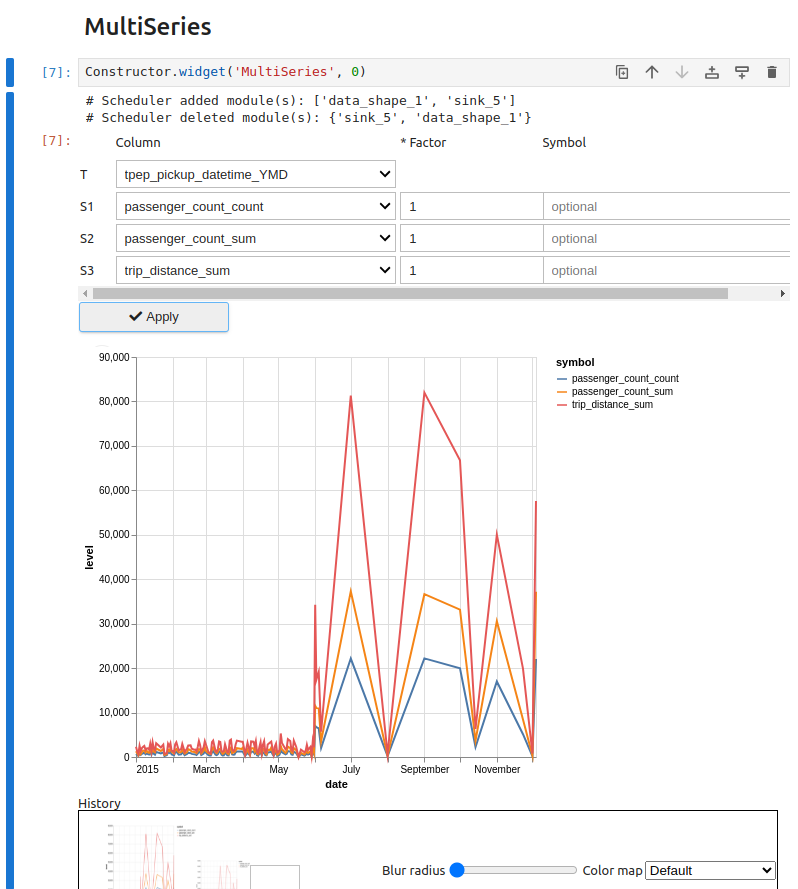
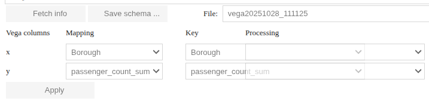
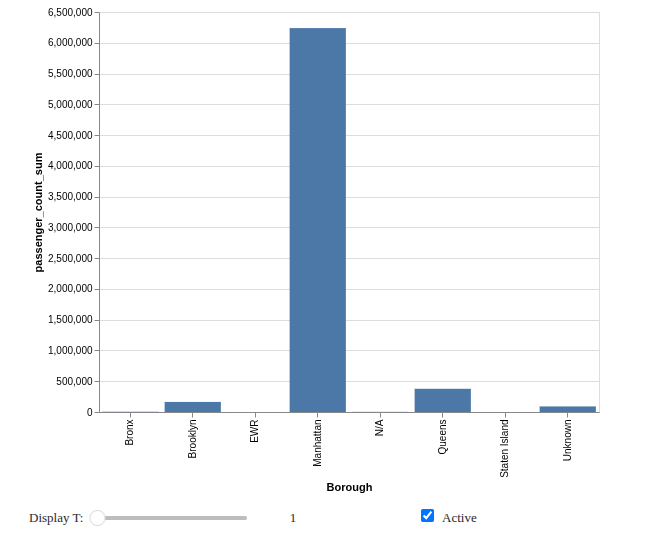
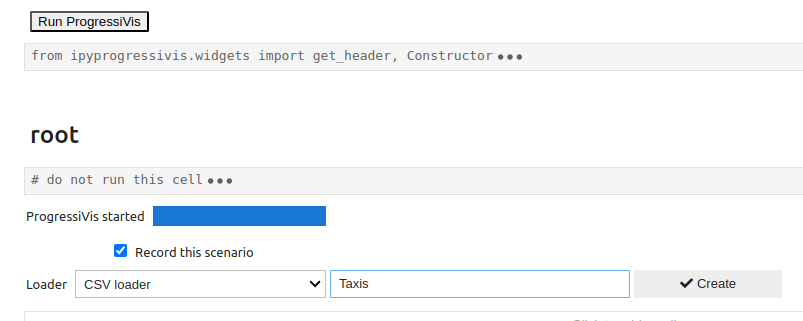

# Visualizations

There is a set of visualizations intended for Progressivis and usable with [JupyterLab](https://jupyterlab.readthedocs.io/en/latest/) grouped in a separate package called `ipyprogressivis`.

(create-scenario)=

## Create a scenario

Notebooks hosting a progressive scenario need to be initialized in a particular way. One call them **ProgressiBooks** and they must be created via the `Progressivis/New ProgressiBook` menu:


Once created, a `Run ProgressiVis` button will appear in the first `ProgressiBook` cell.

By clicking this button, the `ProgressiVis` scheduler will be launched and the start box will appear. Currently, it proposes two data loading actions (CSV files and PARQUET files), and offers the option (by checking the `record this scenario` box) of saving the session for later use. These actions, like all other actions in the scenario, are implemented via a set of `chaining widgets`.




## Chaining widgets

As their name suggests, chaining widgets (`CW`) are graphical components based on Jupyter widgets that can be composed to implement data analysis scenarios. Their interconnection capabilities enable the creation of directed acyclic graphs (DAGs)

Each `CW` is designed for a specific stage of an analysis scenario (data loading, filtering, joins, etc.) and is associated with a sub-graph of PV modules in the background, usually grouped behind a front panel.

(persistent-settings)=
## Chaining widgets persistent settings

`CW`s require a file tree located in the user's homedir with the following structure:

```
.progressivis/
├── bookmarks
└── widget_settings
    └── CsvLoaderW
        ├── taxis
        └── weather
    └── ParquetLoaderW
        ├── iris
        └── penguins
    ...
    ...
```

**NB:** Only the `.progressivis` directory needs to be created by the user. All other directories and files will be created by widgets as required.

## Chaining widgets list

### Data loaders category

#### CSV loader

Possible topology:


##### Function:

It loads one or many CSV files progressively

After starting, the main interface is:


Where:

* The `Bookmarks` field displays the contents (previously filled in by hand) of the `bookmarks` file in `$HOME/.progressivis`. Lines selected here represent urls ans docal files to be loaded. You can select one or more lines in this field. You can also ignore it and use the following field:
* `New URLs`: if the urls or local files present in bookmarks are not suitable, you can enter new paths here
* `URL to sniff`: Unique  url or local file to be used by the sniffer to discover data. If empty, the sniffer uses the first line among those selected for loading
* `Rows`: number of rows to be taken into account  by the sniffer to discover data
* `Throttle:`force the loader to limit the number of lines loaded at each step
* `Sniff ...` button: displays the sniffer (image below):


The sniffer, among other things, allows you to customize parsing options, select the desired subset of columns and type them.

Once the configuration is complete, you can save it for later use and start loading.


**NB:** The `Freeze` checkbox is useful only when the scenario is being recorded  to be replayed later (see [Recording a scenario](recording-scenario) for more details).

Once loading has begun, the `Next stage` list and the `Chain it` button will be used to attach a new `CW` to the treatment.


#### PARQUET Loader

Possible topology:


##### Function:

It loads one PARQUET file progressively

After starting, the main interface is:



You have to activate the sniffer and select the desired columns before loading:


(custom-loader)=

#### CUSTOM Loader

Possible topology:


##### Function:

Allows users to code their own loader in _Python_, respecting a few conventions to ensure connectivity.

After starting, a pre-filled magic cell is displayed:

```python
%%pv_run_cell -p Rand,0
scheduler = proxy.scheduler
# Warning: keep the code above unchanged
# Put your own imports here
...
...
with scheduler:
    # Put your own code here
    ...
    ...
    # fill in the following proxy attributes:
    proxy.output_module = ...  # Module | TableFacade
    proxy.output_slot = 'result'  # str
    proxy.freeze = True  # bool
    # Warning: keep the code below unchanged
    display(proxy.resume())
```

To illustrate, a simple example is given below. It simulates data loading via a random float data generator in the form of a 4-column `PTable`:

```python
%%pv_run_cell -p Rand,0
scheduler = proxy.scheduler
# Warning: keep the code above unchanged
# Put your own imports here
from progressivis.stats import RandomPTable
from progressivis.core import Sink
with scheduler:
    # Put your own code here
    random = RandomPTable(4, rows=100_000_000, scheduler=scheduler)
    sink = Sink(scheduler=scheduler)
    sink.input.inp = random.output.result
    # fill in the following proxy attributes:
    proxy.output_module = random
    proxy.output_slot = 'result'
    proxy.freeze = True
    # Warning: keep the code below unchanged
    display(proxy.resume())
```

The generated code preceding the user code provides access to the `scheduler`, which is essential for loader operation. It is not recommended to modify this code.
The user code must fill the proxy attributes required for connection: `proxy.output_module` and `proxy.output_slot`. The `proxy.freeze` attribute plays the same role as the checkbox of the same name found in some widgets. It determines behavior in replay mode, see [here](recording-scenario).

### Table operators category

#### Group By

Possible topology:


##### Function:

It groups the indexes of rows containing the same value for the selected column:


Given that tables can contain multi-dimensional values (in particular, the datetime type is represented as a vector with 6 elements: year, month, day, hour, minute, second), this `CW` introduces the notion of sub-columns, enabling rows to be grouped according to a subset of positions (6 sub-columns, in a datetime column). For example, indexes corresponding to the same day can be grouped together in a datetime column by selecting the first 3 sub-columns: year, month, day:


#### Aggregate

Possible topology:



##### Function:

Allows predefined operations to be performed on table rows previously grouped via a **Group by** `CW`:


Each input (column, operation) pair generates a dedicated column in the output table:


#### Join

Possible topology:


##### Function:

Performs a join between two table outputs via one or more columns. Sub-column joins (in the sense described above for group-by) are also supported.

ProgressiVis currently supports `one to one` and `one to many` joins (but not `many to many`).

In a `one to many` join, the table on the `one` side is called `primary` and the table on the `many` side is called `related`.

Obviously, in a `one to one` join, the two roles are interchangeable:

The first step is to select the two inputs and define their respective roles then click `OK`:


We can now define the join and select the columns to be kept in the join from among those in the primary table:


... and those in the related table:


The resultant join table is:


#### View: a computed columns creator

Possible topology:


##### Function:

In addition to stored columns, `ProgressiVis` tables support virtual columns computed from the contents of other columns. Computed columns can be created [programmatically](#computed-columns) or, in some cases, via the **GUI** shown here.

At present, only [](SingleColFunc) columns can be defined through this interface.

This includes:

* numpy universal unary [functions](numpy.ufunc)
* `ProgressiVis` vectorized functions
* ad-hoc defined `if-else` expressions


As numpy functions are numerous, you can deactivate them if you don't need them to lighten the presentation. In this way, only vectorized functions will be displayed:


For example, if you want a new column representing the logarithm of another stored column, you can proceed as follows (note that other stored columns can be selected to appear as they are in the result view):


giving the following result:


An example involving a `ProgressiVis` vectorizable function is the creation of a column providing the (human friendly) week day from a stored `datetime` column:


which produce the following result:


An example using `if-else` expressions is taken from the weather domain. Some datasets providing rainfall information mix floating values with the symbol `T`, which means _trace amount of precipitation_, i.e. [a very small amount of rain that might wet the ground, but is too small to be detected in a rain gauge](https://geo.libretexts.org/Bookshelves/Meteorology_and_Climate_Science/Practical_Meteorology_(Stull)/07%3A_Precipitation_Processes/7.07%3A_Precipitation_Characteristics).

Assuming we want to replace “T” with a float value (say -1.0) to have only float values, we'll create an 'if-else' expression as follows:


then use it to create a computed column based on the `PrecipitationIn`stored column:


to produce the following result:


#### Façade creator

The [facade concept](#facade-concept) is particularly useful in the context of `chaining widgets`, as it enables the chaining of widgets managing complex networks of modules. Currently, chaining widgets support many input modules, but only one output module. In complex cases requiring many output modules, these will be grouped together behind a facade representing the single, module-alike, output.

Possible topology:


##### Function:

Visual tool for building a [](TableFacade) around a main module by adding descriptive and filtering modules of column-level granularity.

The `Settings` pane includes several tabs that group the columns of the input table according to their type family: numeric, string and categorical, with the exception of the first tab named `All columns`.


This first tab does two things:

* designate columns to be ignored
* designate columns to be treated as categorical, as this characteristic cannot be deduced from the physical type of the column, because it is linked to the semantics of the data.

The other tabs allow you to associate the desired descriptive statistics and filtering operations with each column. Grouping columns by type family is motivated by the need to associate appropriate operations with each family (for example, variance computing is only justified for numerical types).

Obviously, the widest range of operations is proposed for numerical types:


### Free coding category

#### Python

Possible topology:


##### Function:

It's a pseudo-widget that lets you insert custom code into a `CW` topology via various forms of _magic cells_. Custom code can be chained after any widget by selecting "Python" in the widget's `Next stage` list and pushing `Chain it` button.

After starting, a pre-filled magic cell is displayed:

```python
%%pv_run_cell -p Python,0
# The 'proxy' name is present in this context and you can reference it.
# it provides the following attributes:
#  - proxy.input_module: Module | TableFacade
#  - proxy.input_slot: str
#  - proxy.input_dtypes: dict[str, str] | None
#  - proxy.scheduler: Scheduler
# Put your own imports here
...
...
with scheduler:
    # Put your own code here
    ...
    ...
    # fill in the following proxy attributes:
    proxy.output_module = ...  # Module | TableFacade
    proxy.output_slot = 'result'  # str
    proxy.freeze = True  # bool
    # Warning: keep the code below unchanged
    display(proxy.resume())
```

To illustrate, a simple example is given below. It implements a 'range querying' 2D stage:

```python
%%pv_run_cell -p Python,0
# proxy object provides the following attributes:
#  input_module: Module | TableFacade
#  input_slot: str
#  input_dtypes: dict[str, str] | None
#  scheduler: Scheduler
# Put your own imports here
from progressivis.table.range_query_2d import RangeQuery2d
from progressivis.table.constant import ConstDict
from progressivis.utils.psdict import PDict
from progressivis.core import aio, Sink
scheduler = proxy.scheduler
with scheduler:
    # Put your own code here
    low = PDict({"_1_arcsin": 0.2, "_2_arccos": 0.2})
    low = ConstDict(pdict=low, scheduler=scheduler)
    high = PDict({"_1_arcsin": 1.2, "_2_arccos": 1.2})
    high = ConstDict(pdict=high, scheduler=scheduler)
    range_qry = RangeQuery2d(column_x="_1_arcsin", column_y="_2_arccos", scheduler=scheduler)
    range_qry.create_dependent_modules(
        proxy.input_module, proxy.input_slot, min_value=low, max_value=high
    )
    sink = Sink(scheduler=scheduler)
    sink.input.inp = range_qry.output.result
    # fill in the following attributes:
    proxy.output_module = range_qry
    proxy.output_slot = 'result'
    proxy.freeze = True
    # Warning: keep the code below unchanged
    display(proxy.resume())
```

The pre-filled code preceding the user code provides access to a proxy object giving access via three attributes (`input_module`, `input_slot` and `scheduler`) to connection data with the input widget. It is not recommended to modify this code.

The user code must fill the proxy attributes required by the next stage for connection: `proxy.output_module` and `proxy.output_slot`. The `proxy.freeze` attribute plays the same role as the checkbox of the same name found in some widgets. It determines behavior in replay mode, see [here](recording-scenario).


**NB:** In addition to the `%%pv_run_cell` command for entering code online, users can save their scripts (let's say `foo.py`) in the usual `CW` settings location (`$HOME/.progressivis/widget_settings/Python/foo.py) and execute them with the following command:

```python
%pv_run_cell -f foo.py
```

#### CUSTOM Loader

This is a particular case of the previous pseudo-widget, useful when code is not chained from another `CW`. This is the case for custom data loaders explained [here](custom-loader)


### Display tools category

#### Dump table

Possible topology:


##### Function:

This is the simplest chaining widget that requires no configuration. It is used to display progressive table outputs and has already been used to illustrate the outputs of the widgets presented above.


#### Descriptive statistics

Possible topology:


##### Function:

This chaining widget brings together several descriptive statistics processes.

The `Setting / General` editor is designed to define operations on a single variable, with the exception of covariance calculation, which involves several variables:


Simple results are displayed together:


while the covariance matrix is shown in a separate panel:


Histograms (1D) are also displayed in a dedicated panel. This display is divided into two parts:

* at the top, a rough histogram of the entire interval of variable values, completed by two vertical rulers (in red) that can be positioned using the `Range` slider to delimit a sub-interval.
* at the bottom, a more detailed histogram for the interval defined in the first part:


Heatmaps are used to visualize 2D histograms. Variable pairs are selected for visualisation in a dedicated editor:


Each heatmap will be displayed in a dedicated panel:


#### Heatmap

Possible topology:


##### Function:

This widget provides the same functionality as the namesake tab in "Descriptive statistics" (i.e. visualize 2D histograms), but with greater freedom of configuration.

Given that currently:

* a histogram requires many entries (data, minimum, maximum)
* a source widget can expose only one connectable output module

the `Heatmap` widget must be connected to the output of a `Façade` widget, configured to produce thre required entries:


Once connected, the widget can be configured as follows


#### Multi-series


Possible topology:


##### Function:

This widget allows you to view several time series together:



#### Any Vega

Possible topology:


##### Function:


Allows a user to integrate vega-based visualizations from customized schemas into a scenario. Schemas can be edited, saved and reused in a similar way to `CSV loader` settings.

NB: The entry for an _Any Vega_ widget is always a `Facade`.


The "fetch info" button extracts the list of fields present in the schema before pairing them with members of the input facade and associating them (potentially) with element-wise processing operations.



The rendering is similar to previous ones:




(recording-scenario)=
## Recording a scenario

A `ProgressiBook` lets you save a scenario for later replay. The record is persistent and it is contained in the `ProgressiBook` itself, so it's a good idea to save it at the end of the recording (even if Jupyter does automatic backups periodically).

The scenario is saved only if the corresponding box in the start widget is checked:



After that, the scenario is built as explained [above](create-scenario), with an extra detail: the `Freeze` checkbox, present in certain widgets:


When the freeze checkbox has been checked in a widget (here CSV Loader) during registration, all settings made in this widget will be integrated into the record.
Thus, when the record is replayed, these settings will be applied directly, without redisplaying the "frozen" widget.

**NB:** Scenario registration should not be confused with the [persistent settings](#persistent-settings) of certain widgets, which are saved in dedicated files and can also be used in unregistered scenarios.


## How to create a chaining widget ?

Comming soon ...
